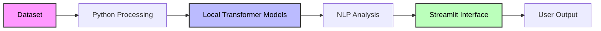

# 🚀 SUMMIFY AI

> [!NOTE]
> **SUMMIFY AI** is a locally running Artificial Intelligence application built to understand and process news articles using Natural Language Processing (NLP).

---

## 📋 Table of Contents
- [What is SUMMIFY AI?](#what-is-summify-ai)
- [Why is This Project Needed?](#why-is-this-project-needed)
- [How Does SUMMIFY AI Work?](#how-does-summify-ai-work)
- [Core Architecture Decisions](#core-architecture-decisions)
- [Project Goal](#project-goal)

---

## 🔍 What is SUMMIFY AI?

The application reads large news articles, understands their content using AI models, and automatically performs intelligent tasks:

* 📝 **Summarization**: Generates short, coherent summaries.
* 🏷️ **Classification**: Identifies exact article categories.
* 🎭 **Sentiment Analysis**: Analyzes emotional tone.
* 📊 **Visualization**: Maps and visualizes commonly used words.

This project was developed as an academic NLP research and implementation project focused on **AI-based text understanding**, **transformer-based language models**, and **practical offline AI deployment**.

---

## 💡 Why is This Project Needed?

Modern news and online content are growing rapidly, leading to major challenges:
* 🛑 **Information Overload**: Long articles consume valuable time.
* 🕵️ **Manual Sorting**: Difficulty identifying article topics and relevance quickly.

SUMMIFY AI solves this by reducing reading time, automating content organization, and providing an accessible platform for **NLP learning**, **AI experimentation**, and **offline academic research**.

---

## ⚙️ How Does SUMMIFY AI Work?

### 🔄 System Architecture Flow

### 🛠️ Step-by-Step Execution

#### **Step 1 — Dataset Ingestion**
The user uploads a news dataset in Excel format. The system uses **Python** and **Pandas** to extract:
* Titles & Content
* Summaries & Categories
* Associated Images & Publication details

#### **Step 2 — Local Model Loading**
The application loads pre-downloaded Transformer models stored directly inside the local project folder. 

| 🧠 NLP Task | 🔬 Model Used | 🟢 Status |
| :--- | :--- | :--- |
| **Summarization** | `DistilBART` | Local / Offline |
| **Classification** | `BART MNLI` | Local / Offline |
| **Sentiment Analysis** | `DistilBERT SST-2` | Local / Offline |

> [!TIP]
> Because models are stored locally, no internet connection is required, startup is faster, and the project remains entirely portable.

#### **Step 3 — Task Selection**
The user interacts with the UI to select a specific article and choose an action (e.g., summarize, classify, analyze sentiment).

#### **Step 4 — Transformer Processing**
The models convert text into numerical vectors. Using deep learning and **Transformer architecture**, the system captures contextual word relationships and semantic meaning rather than relying on basic keyword matching.

#### **Step 5 — Results & Visualization**
The output is instantly displayed via generated summaries, predicted categories, sentiment scores, and interactive **word cloud visualizations**.

---

## 🏗️ Core Architecture Decisions

### 🤖 Why Transformer Models?
Traditional NLP systems relied heavily on manual rules and static dictionaries. This project uses Transformer-based Hugging Face models because they:
* 🎯 Understand deep contextual meaning.
* ⛓️ Process long-form sentences effectively.
* ✍️ Generate highly accurate, human-like summaries.

### 🔒 Why Offline Local Execution?
Data privacy and accessibility are core priorities. Local execution ensures:
* ❌ **Zero Cloud Dependencies**: No external API calls or sudden connection failures.
* 💰 **Zero Cost**: No recurring API subscription fees.
* ✈️ **100% Portability**: Run the entire pipeline anywhere, completely offline.

### 🎨 Why Streamlit?
Streamlit serves as our lightweight web interface dashboard because it allows **rapid UI development**, native interactive visualizations, and local browser-based execution without complex frontend overhead.

---

## 🎯 Project Goal

The primary goal of **SUMMIFY AI** is to demonstrate how modern NLP and Transformer-based AI systems can be seamlessly integrated into a fully offline, locally executable application capable of intelligent text understanding and analysis.
